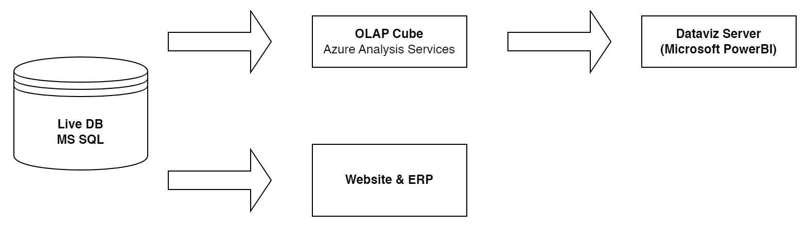
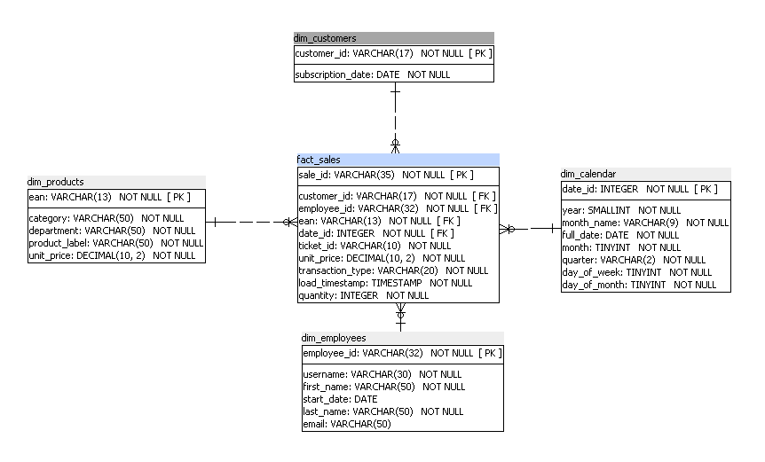
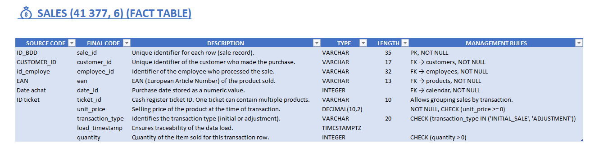
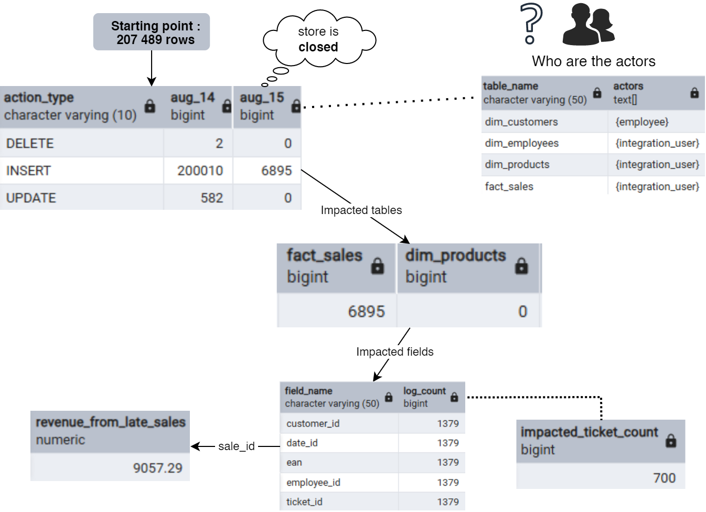

# Forensic Audit of an Unstable OLAP Revenue KPI


> **A data engineering investigation that traced a €9,057 revenue discrepancy to its root cause — using Python ETL, PostgreSQL star schema prototyping, and SQL log forensics.**

---

## Overview

A Business Intelligence team reported that their daily revenue figures were silently changing days after the fact — the same KPI, two different values depending on when you looked. This project is a full forensic audit: reverse-engineering the OLAP architecture, building a clean star schema POC in PostgreSQL, cross-referencing 207,489 log entries with sales data, and proving the exact source of the €9,057.29 discrepancy. The audit concludes with a set of architectural recommendations implemented directly in the prototype.

---

## 🎯 The Challenge

**Simulated business case — SuperSmartMarket** is a French retail chain using a Microsoft OLAP cube (Azure Analysis Services) as the single source of truth for all BI reporting (Power BI).

The head of the BI team observed a critical anomaly:

| Date of Reading | Reporting Date | Revenue |
| :---: | :---: | ---: |
| Aug 14, 2024 | Aug 14, 2024 | **€275,186.59** |
| Aug 16, 2024 | Aug 14, 2024 | **€284,243.88** |

The store was **closed on Aug 15**. Yet the historical revenue for Aug 14 had changed. No one could explain why.

The mission: audit the data pipeline, identify the root cause, and propose a resilient architecture.

---

## 💡 The Solution & Architecture

The investigation followed a 3-phase approach:

**Phase 1 — Understand the architecture and model the data**
Reverse-engineered the flat OLAP extract to produce a data dictionary and design a proper star schema, then loaded the data into a local PostgreSQL prototype via a Python ETL pipeline.

**Phase 2 — Analyse the logs**
Loaded 207,489 activity log entries into the prototype and used SQL cross-referencing to pinpoint when, what, and who inserted data on a day the store was closed.

**Phase 3 — Recommendations**
Identified architectural flaws and implemented corrective measures directly in the prototype (enriched fact table, stored procedures, indexing strategy, RGPD compliance).

### Data Flow Architecture

The data travels through three layers: a transactional source (MS SQL / ERP), an OLAP warehouse (Azure Analysis Services), and a BI reporting layer (Power BI). The audit focused on the OLAP layer and the ETL process feeding it.



### Star Schema (PostgreSQL Prototype)

The source data was reverse-engineered into a proper star schema with one fact table (`fact_sales`) and four dimension tables. The prototype was built locally in PostgreSQL to serve as the investigation environment for all SQL queries.



### Enriched Fact Table — Key Recommendation

The original `fact_sales` table had no price or quantity snapshot, forcing revenue calculations to join against `dim_products` — making historical CA vulnerable to catalogue price updates. Four columns were added to freeze each transaction at the time of sale.



---

## 🔍 The Forensic Finding

The investigation produced a step-by-step proof using SQL log analysis:



**Starting point:** 207,489 log lines. The store was closed on Aug 15 — yet 6,895 INSERT operations were recorded that day, exclusively on `fact_sales`. Tracing those inserts back to the sales table yielded the exact discrepancy.

**The smoking gun query:**

```sql
-- Step 5: Calculate the revenue from the late-arriving sales
SELECT
    SUM(f.quantity * f.unit_price) AS revenue_from_late_sales
FROM fact_sales f
WHERE f.sale_id IN (
    SELECT DISTINCT row_id
    FROM app_logs
    WHERE log_date  = '2024-08-15'
      AND action_type = 'INSERT'
      AND table_name  = 'fact_sales'
);
/*
| revenue_from_late_sales |
|------------------------:|
|                 9057.29 |    ← matches the observed discrepancy exactly
*/
```

**Root cause confirmed:** The OLAP cube allows modifications to historical data, behaving like a live OLTP system. The recommended fix (adding a `transaction_type` column to `fact_sales`) makes the split between initial sales and late adjustments permanently visible:

```sql
SELECT
    SUM(f.quantity * f.unit_price) FILTER (WHERE transaction_type = 'INITIAL_SALE') AS initial_sales,
    SUM(f.quantity * f.unit_price) FILTER (WHERE transaction_type = 'ADJUSTMENT')   AS adjustments,
    SUM(f.quantity * f.unit_price)                                                   AS total_revenue
FROM fact_sales f
JOIN dim_calendar c ON c.date_id = f.date_id
WHERE c.full_date = '2024-08-14';
/*
| initial_sales | adjustments | total_revenue |
|:-------------:|:-----------:|:-------------:|
|  275,186.59   |   9,057.29  |  284,243.88   |
*/
```

### 💥 Stress Test: Simulating a Catalogue Price Update

To prove the new model's resilience, a controlled simulation was run inside a `BEGIN/ROLLBACK` transaction — meaning **zero permanent impact** on the database. All prices in `dim_products` were increased by 15%, then both calculation methods were compared against the known truth.

| Method | Revenue | Delta vs Truth |
| --- | ---: | ---: |
| **Legacy** (JOIN on dim_products) | €326,907.56 | **+€42,663.68** 💥 |
| **New** (frozen unit_price in fact_sales) | €284,243.88 | **0.00** ✅ |

The legacy method's revenue silently inflated by **€42K** after a catalogue update — without any sale actually occurring. The new model is completely unaffected. Full script: [`sql/log_analysis.sql`](sql/log_analysis.sql)

---

## 🛠️ Tech Stack

| Category | Tools |
| --- | --- |
| **Language** | Python 3.11+ |
| **Data manipulation** | Pandas, NumPy |
| **Database** | PostgreSQL 18 |
| **ORM / DB connector** | SQLAlchemy, psycopg2-binary |
| **Notebook** | Jupyter Lab |
| **Schema design** | SQL Power Architect |
| **Diagrams** | Draw.io |
| **Dependency management** | Poetry |
| **Config / Secrets** | python-dotenv |

---

## 🚀 How to Run

### Prerequisites

- **Python 3.11+**
- **Poetry 2.x** — the system Poetry bundled with Ubuntu/Debian is too old. Install the official version:

  ```bash
  curl -sSL https://install.python-poetry.org | python3 -
  export PATH="$HOME/.local/bin:$PATH"
  ```

- **Docker** — to run PostgreSQL with automatic schema initialization

### Setup

#### 1. Clone and install dependencies

```bash
git clone https://github.com/abguven/olap-revenue-forensics.git
cd olap-revenue-forensics
poetry env use python3.11  # if your system defaults to an older version
poetry install
```

#### 2. Configure your environment

```bash
cp .env.example .env
# Edit .env with your PostgreSQL credentials
```

```ini
DB_USER=postgres
DB_PASSWORD=your_password
DB_HOST=localhost
DB_PORT=5432
DB_NAME=supersmart_poc
```

#### 3. Add the data files

The `data/` directory is excluded from the repository. Place the following files there:

```text
data/
├── Extraction+cube+OLAP+-+14+aout+2024.xlsx
└── Logs.xlsx
```

#### 4. Start PostgreSQL

The schema is created automatically at container startup:

```bash
docker run --name supersmart-poc \
  -e POSTGRES_USER=postgres \
  -e POSTGRES_PASSWORD=your_password \
  -e POSTGRES_DB=supersmart_poc \
  -v $(pwd)/sql/create_schema.sql:/docker-entrypoint-initdb.d/create_schema.sql \
  -p 5432:5432 -d postgres:18-alpine
```

#### 5. Run the notebook

The notebook handles data loading, cleaning, transformation, and ETL into PostgreSQL in a single interactive pipeline:

```bash
poetry run jupyter notebook notebooks/audit_analysis_etl.ipynb
```

Execute all cells sequentially. The notebook will populate the database and run all analytical queries.

---

## 🧠 Technical Challenges Overcome

### 1. Excel silently converting EAN barcodes to scientific notation

Product EAN codes (13-digit barcodes) were being read by Excel as floating-point numbers and stored in scientific notation (e.g., `1.23E+12`). This corrupted join keys between `fact_sales` and `dim_products`. **Fix:** forced `dtype={'EAN': str}` at the Pandas read stage and added validation logic in the notebook to detect and reject any remaining scientific notation values before DB insertion.

### 2. Dates stored as Excel serial numbers

Date columns across multiple tables were stored as integer serial numbers (e.g., `45153` instead of `2023-08-14`), a side effect of the Excel-to-CSV pipeline. **Fix:** applied `pd.to_datetime(col, unit='D', origin='1899-12-30')` with per-column calibration after verifying the expected date range.

### 3. Log forensics — correlating 207K rows across tables

The logs contained raw IDs with no readable context. Identifying which log entries corresponded to which business event required building a progressive SQL investigation: first isolating the anomalous date, then the affected table, then the impacted fields, then reconciling with the sales table to compute the exact revenue impact. See [`sql/log_analysis.sql`](sql/log_analysis.sql) for the full step-by-step proof.

### 4. OLAP cube acting as a mutable OLTP system

The fundamental architectural flaw: the OLAP cube had no immutability guarantees. Historical data could be silently overwritten by the ETL process. **Fix proposed:** enrich `fact_sales` with an immutable price snapshot (`unit_price`, `quantity`) at insert time, and add a `transaction_type` flag to distinguish initial sales from late adjustments. This was implemented and demonstrated in the prototype.

### 5. Data corruption: prices converted to dates by Excel

In the log files, the `detail` column (which stores the changed value) contained prices that Excel had silently auto-formatted as dates before CSV export — `1.8` became `August 1st`, `06.09` became `September 6th`. These corrupted strings then got stored as text in the logs, making the column unusable in its raw state. **Fix:** implemented a targeted Pandas parsing strategy to detect and convert date-formatted strings back to their true numeric values before loading into `app_logs`.

### 6. Security & governance: rogue integration user and GDPR exposure

The log analysis revealed that 99.9% of all destructive operations (UPDATE, DELETE) were performed by a single integration user with an **invalid 33-character ID** containing non-hexadecimal characters — a clear violation of the MD5 standard used for all other user IDs, pointing to an untracked, non-compliant service account. Additionally, the `dim_employees` table exposed `hash_mdp` (password hashes) directly in the analytical layer. **Fix:** the user was identified, renamed for traceability, and flagged in the audit report. The `hash_mdp` column was deliberately excluded from the final schema in line with GDPR data minimisation principles.

---

## 📄 Documents

A full 30-page audit report and a presentation slide deck are available.

*Note: Both documents are in French as they were prepared for the original French business stakeholder.*

- 📄 **[Download the Full Audit Report (PDF)](docs/data_audit_report.pdf)**
- 🖥️ **[Download the Presentation Slides (PDF)](docs/presentation_slides.pdf)**

---

## 📁 Project Structure

```text
SuperSmartMarket/
├── notebooks/
│   ├── audit_analysis_etl.ipynb   # Interactive ETL + forensic analysis
│   └── tools.py                   # Reusable display & stats utilities
├── sql/
│   ├── create_schema.sql            # Schema creation
│   ├── business_queries.sql         # Business queries (revenue, top clients, employees)
│   ├── log_analysis.sql             # Step-by-step forensic log analysis
│   ├── stored_procedures.sql        # Stored procedures (calendar population)
│   ├── stored_procedures_demo.sql   # Stored procedure demo
│   └── integrity_checks.sql         # Data integrity checks
├── assets/
│   ├── company_architecture.png    # OLTP → OLAP → BI data flow
│   ├── star_schema.png             # PostgreSQL star schema
│   └── late_sales_analysis.png     # Forensic finding diagram
├── docs/
│   ├── data_audit_report.pdf       # Full 30-page audit report
│   └── presentation_slides.pdf     # Presentation slide deck
├── data/                           # Not tracked (see .gitignore)
├── .env.example                    # Environment variable template
├── pyproject.toml                  # Poetry dependencies
└── README.md
```
